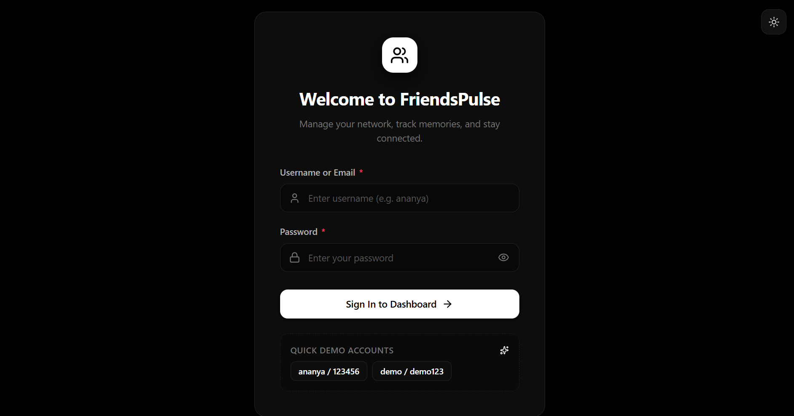
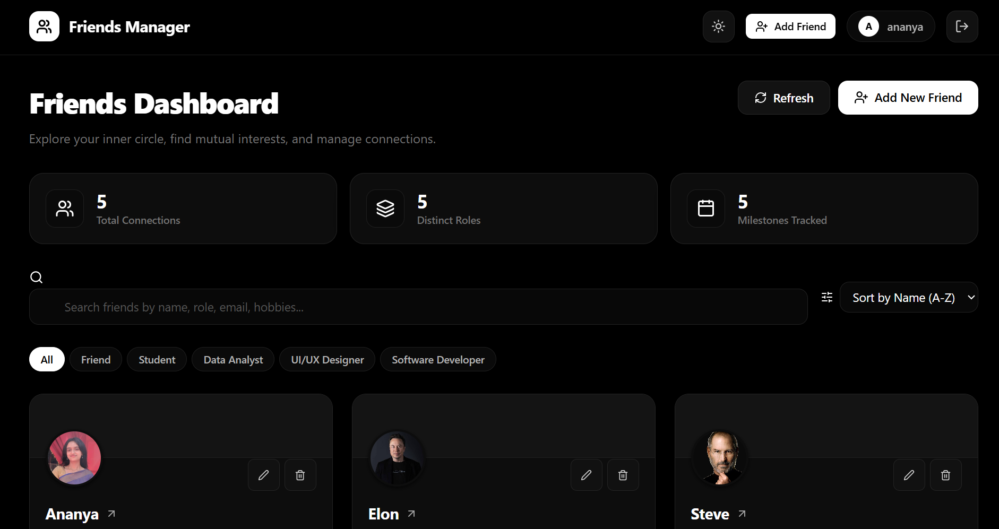
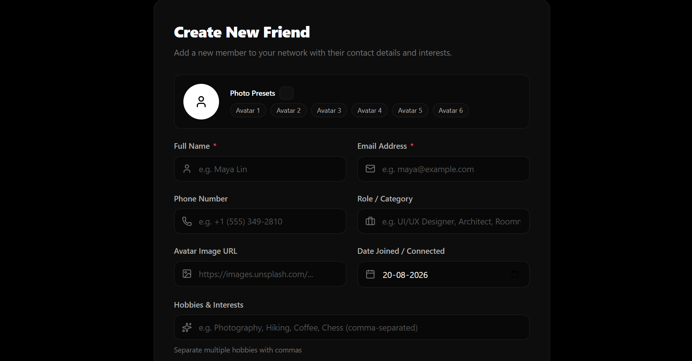

# Friends Manager

Friends Manager is a full-stack web application that helps users manage their friends in one place. The application includes user login and registration, a friends dashboard, friend details, and options to create, update, and delete friends.

## Features

- User login and registration
- Friends dashboard
- View all friends
- View individual friend details
- Add a new friend
- Edit friend information
- Delete a friend
- Responsive React frontend
- RESTful backend API
- SQLite database

---

## 1. Tech Stack

### Frontend
- React.js
- Vite
- JavaScript
- CSS
- Lucide React

### Backend
- Python
- FastAPI
- SQLAlchemy
- Pydantic
- Uvicorn

### Database
- SQLite

---

## 2. Project Structure

```text
friends-manager-app/
│
├── backend/
│   ├── database.py
│   ├── main.py
│   ├── models.py
│   ├── seed.py
│   └── test_e2e_api.py
│
├── frontend/
│   ├── public/
│   ├── src/
│   │   ├── components/
│   │   ├── context/
│   │   ├── pages/
│   │   ├── services/
│   │   ├── App.jsx
│   │   ├── App.css
│   │   └── index.css
│   ├── screenshot/
│   │   ├── login.png
│   │   ├── dashboard.png
│   │   ├── friends-details.png
│   │   └── create-friend.png
│   ├── package.json
│   └── vite.config.js
│
├── .gitignore
└── README.md
```

---

## 3. Setup & Installation

### Clone the Repository

```bash
git clone https://github.com/Ananya-L-Bhargav/friends-manager-app.git
```

```bash
cd friends-manager-app
```

### Backend Setup

Navigate to the backend folder:

```bash
cd backend
```

Create a virtual environment:

```bash
python -m venv venv
```

Activate the virtual environment on Windows:

```bash
venv\Scripts\activate
```

Install the backend dependencies:

```bash
pip install fastapi uvicorn sqlalchemy pydantic
```

---

## 4. Start the Backend Server

From the `backend` folder, run:

```bash
uvicorn main:app --reload
```

The backend server will run at:

```text
http://127.0.0.1:8000
```

FastAPI API documentation is available at:

```text
http://127.0.0.1:8000/docs
```

---

## 5. Start the React Frontend

Open a new terminal and navigate to the frontend folder:

```bash
cd frontend
```

Install the frontend dependencies:

```bash
npm install
```

Start the React development server:

```bash
npm run dev
```

---

## 6. API Documentation

### Authentication

| Method | Endpoint | Description |
|---|---|---|
| POST | `/api/register` | Register a new user |
| POST | `/api/login` | Authenticate an existing user |

### Friends

| Method | Endpoint | Description |
|---|---|---|
| GET | `/api/friends` | Get all friends |
| GET | `/api/friends/{friend_id}` | Get details of a specific friend |
| POST | `/api/friends` | Create a new friend |
| PUT | `/api/friends/{friend_id}` | Update an existing friend |
| DELETE | `/api/friends/{friend_id}` | Delete a friend |

---

## 7. Screenshots

### Login Screen



### Friends List



### Friend Details


### Create Friend

